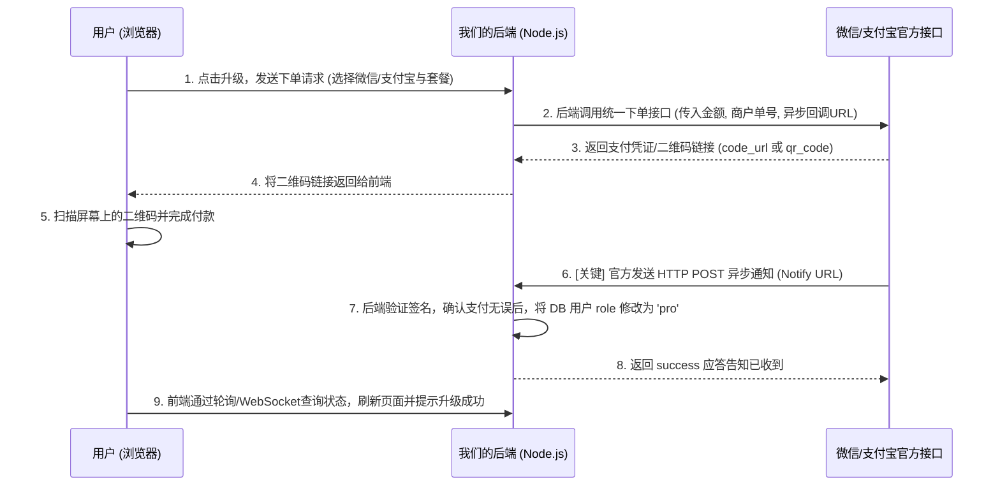

# VidFetch 微信支付与支付宝支付真实接入指南

本文档将为您详细说明如何在 Node.js + Vue.js 技术栈中接入**真实的微信支付（WeChat Pay）**与**支付宝支付（Alipay）**，以及您需要提前准备和申请的资质与密钥材料。

---

## 一、 支付资质与前置准备工作

微信支付和支付宝对个人开发者均不开放直接的在线即时到账接口（扫码支付/Native支付）。因此，您**必须**具备**企业、个体工商户、或通过特定第三方（如易支付等聚合支付）**资质方可申请真实接口。

### 1. 微信支付申请清单

| 准备材料/资质 | 申请路径 & 说明 |
| :--- | :--- |
| **企业营业执照** | 个体工商户或企业性质的执照（个人无法申请微信官方支付） |
| **ICP 网站备案** | 用于接入的域名必须完成工信部 ICP 备案，且网站内容须合规 |
| **微信服务号/小程序** | 注册并完成微信实名认证（需支付 300 元/年审核费） |
| **微信支付商户号** | 通过服务号或小程序后台申请微信支付商户，绑定营业执照与对公账户 |
| **APIv3 密钥** | 登录微信支付商户平台 $\rightarrow$ 账户中心 $\rightarrow$ API安全，设置 32 位 APIv3 密钥 |
| **API 证书文件** | 下载并生成 `apiclient_cert.pem` 和 `apiclient_key.pem`（用于数字签名与安全校验） |

### 2. 支付宝支付申请清单

| 准备材料/资质 | 申请路径 & 说明 |
| :--- | :--- |
| **支付宝企业账号** | 注册支付宝商家中心（个体户/企业均可，需实名认证） |
| **支付宝开放平台应用** | 登录支付宝开放平台 $\rightarrow$ 控制台 $\rightarrow$ 创建网页/移动应用（如：电脑网站支付） |
| **应用 APPID** | 创建并上线应用后，支付宝分配的唯一应用标识 ID |
| **应用私钥 & 支付宝公钥** | 使用支付宝开发助手生成 RSA2 密钥对。在开放平台后台配置应用公钥，并获取系统分配的“支付宝公钥” |
| **防钓鱼 IP 或域名** | 填写您的生产域名，支付宝将在该域名下接收支付成功的回调通知（Notify URL） |

---

## 二、 微信支付/支付宝整体交互架构

真实扫码支付的开发核心是 **“异步回调通知（Webhook）”**，其标准时序图如下：



---

## 三、 后端 Node.js (Express) 真实核心代码实现

在生产环境中，我们推荐使用成熟的 Node.js 开源 SDK 或直接使用 `axios` 配合证书进行调用。下面为您提供这两种支付的伪代码框架。

### 1. 安装推荐 SDK

```bash
# 支付宝官方 SDK
npm install alipay-sdk

# 微信支付推荐使用 wechatpay-node-v3 或直接自己签名请求
npm install wechatpay-node-v3
```

### 2. 支付宝网页/扫码支付后台逻辑

```javascript
const { AlipaySdk } = require('alipay-sdk');
const fs = require('fs');

// 初始化支付宝 SDK
const alipaySdk = new AlipaySdk({
  appId: '您的支付宝APPID',
  privateKey: fs.readFileSync('./keys/app_private_key.pem', 'ascii'), // 应用私钥
  alipayPublicKey: '您的支付宝公钥字符串', // 从支付宝后台复制
  signType: 'RSA2',
});

// 1. 创建支付宝交易 (扫码付 - alipay.trade.precreate)
app.post('/api/payment/alipay/create', authenticate, async (req, res) => {
  const { plan } = req.body;
  const outTradeNo = 'ALIPAY_' + Date.now() + '_' + Math.random().toString(36).substring(2, 6);
  const amount = plan === 'pro_monthly' ? '20.00' : '199.00';
  const subject = plan === 'pro_monthly' ? 'VidFetch Pro 专业会员月付' : 'VidFetch Pro 永久会员';

  try {
    const result = await alipaySdk.exec('alipay.trade.precreate', {
      bizContent: {
        out_trade_no: outTradeNo,
        total_amount: amount,
        subject: subject,
        // 可选：设置超时时间 15m
        timeout_express: '15m',
      },
      // 支付宝完成支付后，官方服务器会向这个 URL 发送 POST 异步通知
      notifyUrl: 'https://您的域名.com/api/payment/alipay/notify',
    });

    if (result.code === '10000') {
      // qr_code 即为支付二维码链接，前端将其渲染为二维码即可
      res.json({ success: true, qrCodeUrl: result.qrCode });
    } else {
      res.status(500).json({ error: 'PAY_ERROR', message: result.subMsg });
    }
  } catch (error) {
    res.status(500).json({ error: 'SERVER_ERROR', message: error.message });
  }
});

// 2. 接收支付宝异步通知回调
app.post('/api/payment/alipay/notify', express.urlencoded({ extended: true }), (req, res) => {
  const params = req.body;
  // 必须验签，防止伪造请求
  const isValid = alipaySdk.checkNotifySign(params);

  if (isValid && params.trade_status === 'TRADE_SUCCESS') {
    const outTradeNo = params.out_trade_no;
    // TODO: 解析出对应的 username 并在 db.json 中将其 role 升级为 'pro'
    // 升级逻辑示例:
    // const db = readDb();
    // db.users.find(u => ...).role = 'pro';
    // writeDb(db);
    
    // 必须回复 success 给支付宝服务器，否则它会以递减频率重发通知
    res.send('success');
  } else {
    res.send('fail');
  }
});
```

### 3. 微信支付（Native 扫码支付）后台逻辑

```javascript
const WxPay = require('wechatpay-node-v3'); // 假定使用 wechatpay-node-v3 SDK
const fs = require('fs');

const wxpay = new WxPay({
  appid: '您的微信小程序/服务号AppID',
  mchid: '您的微信商户号',
  publicKey: fs.readFileSync('./certs/apiclient_cert.pem'), // 商户 API 证书公钥
  privateKey: fs.readFileSync('./certs/apiclient_key.pem'), // 商户 API 证书私钥
  key: '您的APIv3密钥'
});

// 1. 创建微信 Native 支付订单
app.post('/api/payment/wechat/create', authenticate, async (req, res) => {
  const { plan } = req.body;
  const outTradeNo = 'WECHAT_' + Date.now() + '_' + Math.random().toString(36).substring(2, 6);
  // 微信支付的金额单位是：分 (20元 = 2000分，199元 = 19900分)
  const amount = plan === 'pro_monthly' ? 2000 : 19900; 
  const description = plan === 'pro_monthly' ? 'VidFetch Pro 专业会员月付' : 'VidFetch Pro 永久会员';

  try {
    const params = {
      description,
      out_trade_no: outTradeNo,
      notify_url: 'https://您的域名.com/api/payment/wechat/notify',
      amount: {
        total: amount,
        currency: 'CNY'
      }
    };
    
    // 调用微信支付 native 下单接口
    const result = await wxpay.transactions_native(params);
    if (result.status === 200 && result.data && result.data.code_url) {
      // code_url 即为微信支付二维码，返回前端由 qrcode 库渲染展示
      res.json({ success: true, qrCodeUrl: result.data.code_url });
    } else {
      res.status(500).json({ error: 'WECHAT_PAY_ERROR', message: '获取微信支付二维码失败' });
    }
  } catch (error) {
    res.status(500).json({ error: 'SERVER_ERROR', message: error.message });
  }
});

// 2. 接收微信支付回调通知
app.post('/api/payment/wechat/notify', express.json(), (req, res) => {
  try {
    // 微信 APIv3 回调报文会自动加密，需要使用 SDK 的解密工具
    const headers = req.headers;
    const body = req.body;
    
    // 验签并解密支付结果
    const decoded = wxpay.decryptedNotify(headers, body);
    
    if (decoded && decoded.trade_state === 'SUCCESS') {
      const outTradeNo = decoded.out_trade_no;
      // TODO: 更新 db.json 中的用户 role 为 'pro'
      
      // 返回微信要求的成功报文格式
      res.status(200).json({ code: 'SUCCESS', message: '成功' });
    } else {
      res.status(400).json({ code: 'FAIL', message: '失败' });
    }
  } catch (error) {
    res.status(500).json({ code: 'FAIL', message: error.message });
  }
});
```

---

## 四、 个人/非企业性质开发的平替接入方案

如果您没有企业营业执照，无法向微信和支付宝官方申请商户号，您可以考虑以下替代方案：

1. **聚合支付平台（如 易支付 / 虎皮椒 / 码支付）**：
   - 易支付（Easypay）等平台可以免去企业资质，只需要个人身份证进行实名即可接入。
   - 提供标准的 HTTP API，由它们负责收款并回调您的服务器。
2. **挂机辅助软件（手动扫码监控）**：
   - 用户付款到您的个人支付宝/微信二维码。
   - 在您的安卓手机或服务器上运行监控 APP（如免签支付），监听到账通知后向您的 Node.js 接口发送回调请求。但这种方式稳定性较差，且有封号风险。
3. **人工微信客服转账**：
   - 在套餐升级面板放上您个人的微信/支付宝收款二维码。
   - 用户付款后，通过微信添加您为好友，提供账号名称。
   - 您登录 `mediaAdmin` 系统管理员账号，在“用户管理”面板手动将该用户的角色更改为 `Pro用户` 即可。这也是初创项目最省力、成本最低的验证手段。
